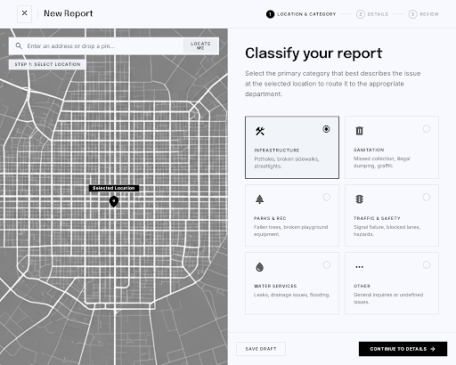
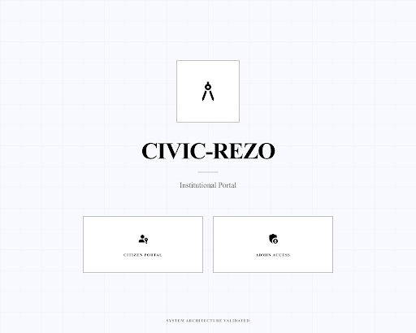
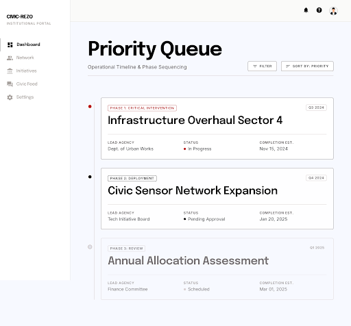
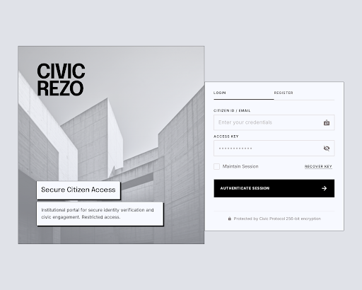
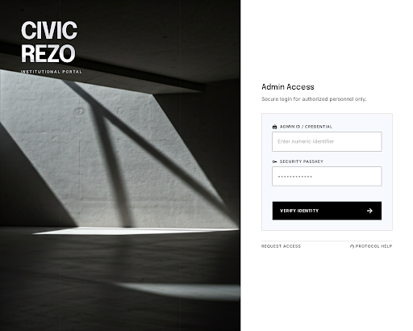
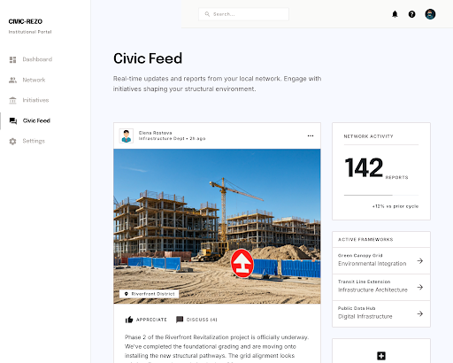

# UrbanPulse — Civic Reporting Platform

This repository contains the UrbanPulse civic reporting platform: a Node.js backend (CIVIC-REZO-Backend) and a React Native frontend (CIVIC-REZO-Frontend) alongside utilities, scripts, and example screenshots.

## Contents
- `CIVIC-REZO-Backend/` — Express backend, APIs, and Python services for ML features.
- `CIVIC-REZO-Frontend/` — React Native app (Expo) with screens, components, and assets.
- `stitch_screens/` — Example UI screenshots used in this README.
- `start_app.sh` — Convenience script to start components locally (adapt before use).

## Quick overview
UrbanPulse provides complaint reporting, admin dashboards, heatmaps, emotion analysis, and auxiliary services (Grad-CAM, DistilBERT emotion). The backend exposes routes under `CIVIC-REZO-Backend/routes` and services in `CIVIC-REZO-Backend/services`.

## Prerequisites
- Node.js 18+ and npm
- Python 3.8+ (for Python services; see `CIVIC-REZO-Backend/python_services/requirements.txt`)
- Expo CLI for frontend (if running locally): `npm install -g expo-cli`
- A Supabase project or equivalent DB for production credentials (see `CIVIC-REZO-Backend/config/supabase.js` and `CIVIC-REZO-Frontend/config/supabase.js`)

## Backend — local run
1. Open a terminal and change to the backend folder:

```bash
cd CIVIC-REZO-Backend
```

2. Install dependencies and start the server:

```bash
npm install
npm start
# or `node server.js` for direct start
```

3. Configure environment values in `CIVIC-REZO-Backend/config/supabase.js` (or set environment variables) before connecting to your Supabase project.

4. Python services

```bash
cd python_services
python -m pip install -r requirements.txt
# run services as required by the backend (see `distilbert_emotion_service.py`)
```

## Frontend — local run (Expo)
1. Open a terminal and change to the frontend folder:

```bash
cd CIVIC-REZO-Frontend
npm install
expo start
```

2. Edit `CIVIC-REZO-Frontend/config/supabase.js` to point to your Supabase project.

## Screenshots / UI preview
The repository includes example screenshots in the `stitch_screens/` folder. Use these as quick previews for the app state.

- New report: 
- Welcome screen: 
- Priority queue: 
- Citizen auth: 
- Admin auth: 
- Citizen dashboard: 

If you want nicer thumbnails or a dedicated `docs/` area, copy the images into `docs/assets/` and reference them from a `docs/README.md` for GitHub Pages.

## Project structure notes (high level)
- `CIVIC-REZO-Backend/server.js` — main entry for the API server.
- `CIVIC-REZO-Backend/routes/` — REST endpoints (auth, complaints, gradcam, heatMap, transcription, etc.).
- `CIVIC-REZO-Backend/services/` — service classes (HeatMapService, EmotionAnalysisService, GradCamService).
- `CIVIC-REZO-Frontend/src/screens/` — major app screens organized by feature.

## Recommended next steps before pushing to your GitHub repo
1. Clean any sensitive secrets from `config/` files (remove API keys, Supabase credentials).
2. Create a `.env.example` file with placeholders for required environment variables.
3. Optionally copy screenshots to a `docs/assets/` folder and add a `docs/` README for richer presentation.
4. Run the app locally to verify everything works in your environment.

## How to push this repository to your target remote
Replace `<REMOTE_URL>` with `https://github.com/kirankishoreV-07/CIVIC_FINAL.git` and run:

```bash
git init
git add .
git commit -m "Add UrbanPulse project and README"
git remote add origin <REMOTE_URL>
git branch -M main
git push -u origin main
```

If your repo already has commits, prefer creating a branch and opening a PR instead of force-pushing.

## License & attribution
Keep or add a LICENSE file appropriate for your project. Verify any third-party dependencies' licenses.

---

If you'd like, I can:
- add a `.gitignore` or `.env.example`
- create a `docs/` directory with formatted screenshots and a dedicated landing README
- prepare a commit and attempt to push (I cannot push without your credentials; I will provide the exact git commands)

Tell me which of these next steps you'd like me to take.
